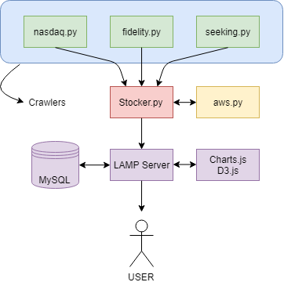

# Stocker

Stocker is a real time stock news analyzer with AWS Comprehend integrated.  
It's purpose is to crawl stock info web pages and analyze various news article with machine learning.  

## Overview

    

As shown above, Stocker is consisted with 4 main parts.  

1. HTML Parsers

    HTML Parsers takes raw HTML code and extract news articles.  

2. AWS Handler  

    AWS API is call from the main program and returns analysis result.  

3. Main Program  

    Manages all parsers and API.  

4. Web Server  

    Runs webapp and display analysis data with charts and wordcloud

### Supported stock news website

1. [www.nasdaq.com](https://www.nasdaq.com)  

2. [www.seekingalpha.com](https://www.seekingalpha.com)

3. [www.fidelity.com](https://www.fidelity.com)

4. TBD

### Machine learning integration w/ AWS Comprehend

Machine learning text analyzer used in this project is AWS Comprehend.  
Crawled news article datas are feeded through AWS Comprehend API and then processed.  
Processed data can be received via JSON data format.  

AWS Comprehend could be used with AWS Translate to provide wide variety of language support.  

### Visualization with JavaScript

Collected datas from the AWS Comprehend are trimmed and organized to be displayed.  
Data visualization is performed with Charts.js & D3.js which is popular open source JavaScript library.  

### Prerequisites

To run this application on your own, you need to meet requirements shown below.  

- **Linux**

    Linux webserver is required to run web application.  
    LAMP(Linux, Apache, MySQL, Python or PHP) is recommended.  
    See installation process below.  

- **Python 3**  

    Python 3(Python 3.5.2) is required for web crawling.  
    built-in `html.Parser` library is used to parse html code.

- **AWS Account**

    AWS is required for AWS Comprehend service.  
    To learn more about AWS Comprehend, visit [here](https://aws.amazon.com/ko/comprehend/)  
    AWS is integrated as API in each crawler.

- **AWS CLI**

    AWS Command Line Interface is required for AWS Comprehend API to work properly.  
    For setting up AWS CLI, check [this](https://docs.aws.amazon.com/ko_kr/comprehend/latest/dg/setup-awscli.html) tutorial.  

- **Apache web server**

    Required to actually run the application.  
    
- **MySQL**
    
    Store data processed by AWS service using MySQL

### Installation

1. This application requires Python 3.  If you don't have it already installed, visit [here](https://www.python.org/downloads/) and download the lastest version.  

2. Use command below to install necessary modules for Python.  
    **For Windows user, run with --user flag**  
    `$ pip install awscli`  
    
    `$ pip install boto3`  
    
    `$ pip install pymysql`  

3. Set up linux server.  Here, we use Ubuntu 16.04 with LAMP installed.  
    **This is required if you want to run it on your own server!!**  
    `$ sudo apt install apache2`  

    `$ sudo apt install mysql-server`  
    
    `$ sudo apt install php php-mysql`  

4. Put Webpage in apache2 directory.  
    `/var/www/html` is the default location for web files.  

5. Login AWS and create IAM User for AWS Comprehend API Access.  For more info, visit [here](https://docs.aws.amazon.com/ko_kr/cli/latest/userguide/cli-chap-install.html).  

6. You are all set!!  

### How to run Stocker  

